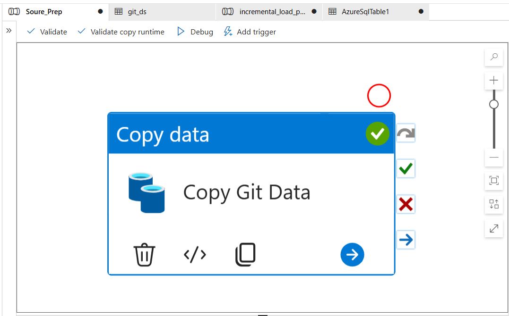
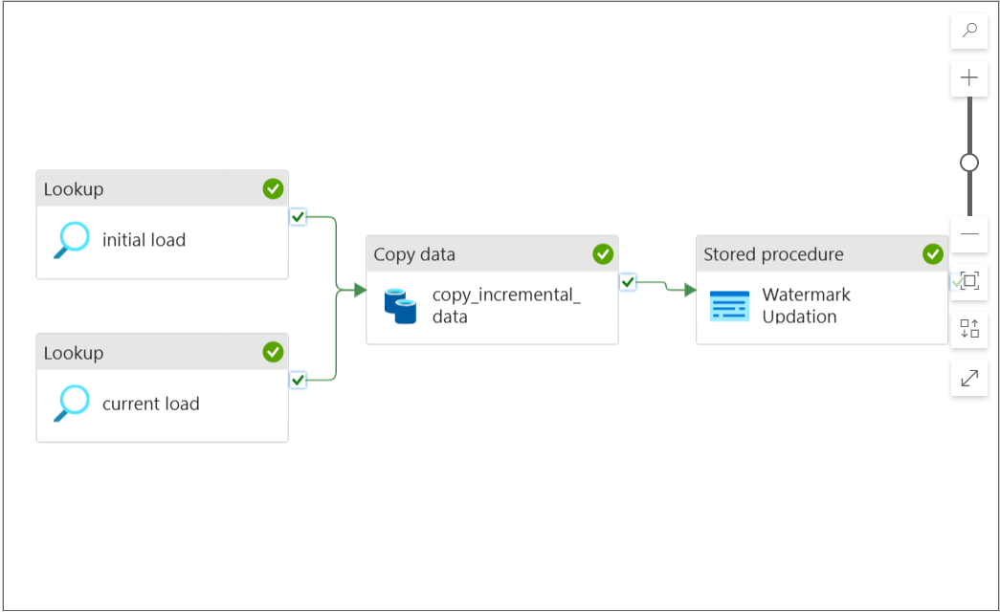

# Modern-Data-Lakehouse-on-Azure-with-Medallion-Architecture

This project walks through the implementation of a **modern data lakehouse architecture** using Microsoft Azure services such as Data Factory, Databricks, Data Lake Gen2, and Power BI. The pipeline is structured using the **Medallion architecture (Bronze, Silver, Gold)** and includes **Delta Lake**, **Unity Catalog**, and **Dimensional Modeling (Star Schema)**.

.png)

---

## 📌 Project Highlights

- ⛓️ Built a scalable **ETL pipeline** using **Azure Data Factory** and **Databricks**. Also ensure the incremental data loading.
- 🧽 Implemented **data transformation** and **cleaning** using **PySpark**
- 🪙 Applied **Bronze → Silver → Gold** layer architecture with **Delta Lake**
- 🧠 Included **Slowly Changing Dimensions (SCD)** and **Dimensional Modeling**
- 🔐 Managed data governance using **Unity Catalog**
- 📊 Delivered final outputs using **Power BI**

---

## 🔧 Tech Stack

| Category         | Tools/Tech Used                          |
|------------------|-------------------------------------------|
| Cloud Platform   | Microsoft Azure                           |
| Orchestration    | Azure Data Factory                        |
| Processing       | Databricks, PySpark                       |
| Storage          | Azure SQL Database, Azure Data Lake Gen2, Delta Lake          |
| Governance       | Unity Catalog                             |
| Data Modeling    | Star Schema, SCD                          |
| Reporting        | Power BI                                  |
| Version Control  | GitHub                                    |

---

## 🧱 Medallion Architecture Overview

| Layer   | Description                                            | 
|---------|--------------------------------------------------------|
| Bronze  | Raw data ingested from SQL source via Data Factory     |
| Silver  | Cleaned and transformed data using PySpark             | 
| Gold    | Final aggregated tables modeled for analytics/reporting| 

---

## 🔄 Dataflow

1. **External Source to Azure SQL Database**  
   The external source in this project is my git repo in which I'm having 2 csv files (sales_data and incremental_data). In this step I have created one pipeline (source_prep) in Azure Datat Factory to dump the external source data into the Azure SQL Database (Sales_db). 

Now after dumping all the data into the database. I have created another pipeline through which we can load initial data as well as incremental data from SQL Database to the Datalake at the bronze layer. 
Before creating this pipeline I have first created one Watermark Table in Sales_db and a stored procedure. Let me tell you in Sales_db we have two tables - car_sales (storing raw_data) and Watermark (one Date_Id column only). 

Now, initial_load lookup is having the Date_id which is from the watermark table and current_load lookup is storing maximum Date_id from car_sales table. so when we run the pipeline stored procedure will basically update the date_id of watermak table with the maximum value of the Date_id in car_sales.

2. **Transformation and Serving**  
   Did some transformations in the raw data from broze datalake and stored the transformed data into the silver datalake as delta table (one big table). Now the data is clean and transformed I have divided that one big table into fact and dimension tables using star schema. And will store it into the gold layer datalake and now the data is ready to serve for further use. I have connected it to Power BI

